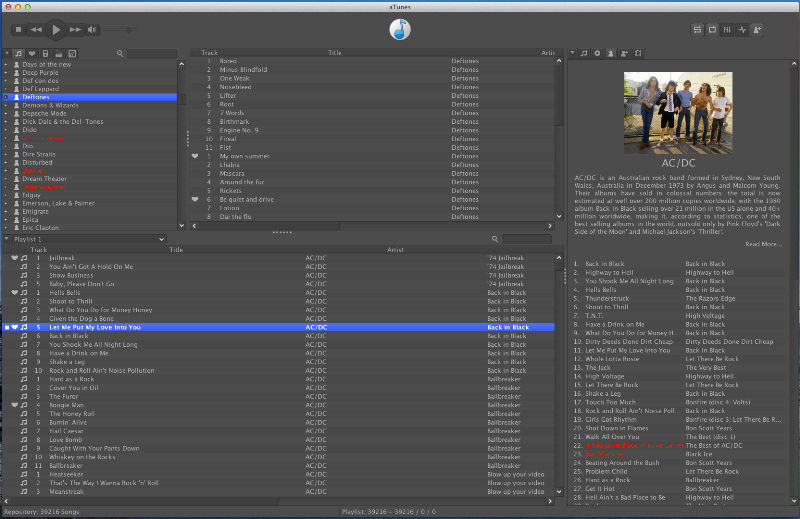

# aTunes
aTunes is a powerful, full-featured, cross-platform player and manager, with support for online radios, podcasts and CD ripping. 

## Features
- Support for huge music collections with thousands of files
- Supports most popular formats: mp3, ogg, wma, wav, flac, mp4...
- Allows tag edition, with advanced features for automatically fill tags properly and batch editing
- Supports several playlists, allowing playlists with thousands of songs
- Allows to organize collection by metadata (artist, album, year, genre, ...) or folder
- Support for external devices to copy or synchronize music
- Supports podcasts
- Supports online radios
- Last.fm scrobbling integrated
- Downloads all information about your music: lyrics, artist information, similar artists, links to Youtube...
- Keep statistics about what you listen to
- Import audio CD to mp3, ogg and include automatically in your collection
- Customizable UI
- Full-screen mode

## License

This project is licensed under the GNU General Public License version 2.0 (GPLv2) - see the [LICENSE](LICENSE) file for details.

## Authors

* **Alex Aranda** - *Founder, developer, translator* - [fleax](https://github.com/fleax)
* **Sylvain Gaudard** - *Developer, translator*
* **Thomas Beckers** - *Developer, translator*

See also the list of [contributors](https://github.com/PDavid/aTunes/blob/master/Contributors.md) who participated in this project.
